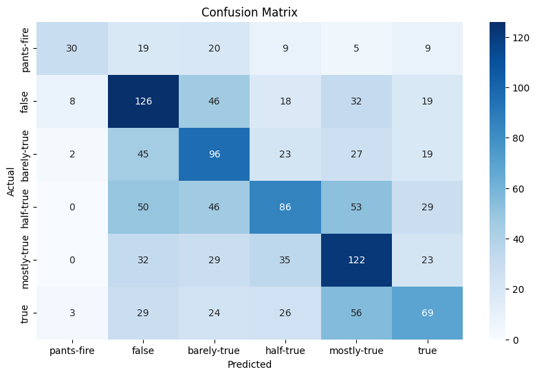

# Fake News Detection with Metadata-Enriched MobileBERT

This project is inspired by the **LIAR** benchmark, a widely used dataset for fine-grained fake news detection built from short political statements and speaker metadata. For more details about the dataset, please check the paper ["Liar, Liar Pants on Fire": A New Benchmark Dataset for Fake News Detection](https://arxiv.org/abs/1705.00648).


# Table of Contents --> Fake News Detection

- [Overview](#overview)
- [Model](#model)
- [Data Processing](#data-processing)
- [Training Pipeline](#training-pipeline)
- [Project Structure](#project-structure)
- [Prerequisites](#prerequisites)
- [Environment Setup](#environment-setup)
- [How to Run](#how-to-run)
- [Evaluation](#evaluation)
- [Performance Summary](#performance-summary)
- [Why the Updated Version Performs Better](#why-the-updated-version-performs-better)
- [Notes](#notes)
- [Acknowledgment](#acknowledgment)
- [License](#license)
- [Contact](#contact)

## Overview

This repository contains an updated implementation for **6-class fake news classification** on the LIAR dataset using a metadata-enriched **MobileBERT** model. For more details about MobileBERT, please check the original paper [here](https://arxiv.org/abs/2004.02984).


## Model

### Model name: **MobileBERT**

### Core architecture
The model uses:
- **Pretrained encoder:** `google/mobilebert-uncased`
- **Backbone:** Hugging Face `AutoModel`
- **Text representation:** CLS token embedding from the last hidden state
- **Regularization:** dropout layer
- **Classifier:** linear layer for 6-way classification

### Prediction labels
The model predicts one of the following classes:
- `pants-fire`
- `false`
- `barely-true`
- `half-true`
- `mostly-true`
- `true`

## Data Processing

A major part of this updated pipeline is the preprocessing strategy.

### 1. Dataset loading
The project expects the standard LIAR dataset split:
- `train.tsv`
- `valid.tsv`
- `test.tsv`

### 2. Label encoding
The original text labels are converted into numeric class ids:

- `pants-fire -> 0`
- `false -> 1`
- `barely-true -> 2`
- `half-true -> 3`
- `mostly-true -> 4`
- `true -> 5`

### 3. Missing value handling
To make the pipeline robust:
- text fields are filled with `unknown`
- numeric metadata fields are filled with `0`

### 4. Metadata-aware input construction
Instead of using only the raw statement, the final model input is built as a **single structured text sequence** containing:
- statement
- subject
- speaker
- speaker job title
- state information
- party affiliation
- context
- speaker history counts

This helps the transformer learn from both content and metadata together.

### 5. Tokenization
The structured input text is tokenized with the MobileBERT tokenizer using:
- maximum sequence length: `192`
- truncation enabled during dataset encoding
- padding to fixed length

### 6. Length filtering
Before training, samples longer than the allowed token length are filtered out. This keeps the input size consistent and reduces noisy truncation.

## Training Pipeline

The training script (```train.py```) includes:
- `AdamW` optimizer
- linear learning rate scheduler with warmup
- gradient clipping
- dropout regularization
- macro-F1 based model selection
- early stopping using validation performance
- best model checkpoint saving


### Loss function
A class-weighted loss function is created from the training distribution. In the current training script, the final optimization step uses standard cross-entropy loss.

** DOWNLOAD THE COMPLETE CODEBASE AS A ZIP FILE AND DOWNLOAD THE PRE-TRAINED MODEL FROM THE LINK [HERE](https://txst-my.sharepoint.com/:u:/g/personal/sii25_txstate_edu/IQA8AFR5l99FSJrkI2hpblDjAZthl68vgmCE2UUIGCfWgHE). THE DATASET IS ALREADY INCLUDED IN THIS REPOSITORY. **

## Project Structure

```bash text
├── train.py      # training pipeline
├── test.py       # evaluation pipeline
├── model.py      # transformer classifier
├── utils.py      # preprocessing, dataset, and dataloader utilities
└── liar_dataset/ # dataset
├   ├── train.tsv
├   ├── valid.tsv
├   └── test.tsv
└── checkpoint/ # trained best checkpoint
├   └── best_model_all.pt
└── assets/ 
    ├── confusion_matrix.png # confusion matrix of this experiment
    └── Paper # baseline Paper
```

## Prerequisites
- **Conda** (Anaconda)
- **Python** ≥ 3.9
- **CUDA-capable GPU** (recommended for training/inference; CPU is supported but slower)


## Environment Setup

Create a conda virtual environment:

```bash
# from the repository root
conda env create -f mobilebert.yml
# activate the environment (use the name defined under `name:` in mobilebert.yml)
conda activate mobilebert
```
## How to Run

### Train

```bash
python train.py --data_dir liar_dataset
```

### Test

```bash
python test.py --data_dir liar_dataset --split test
```


## Evaluation

The evaluation script reports:
- classification report
- confusion matrix
- accuracy
- macro precision
- macro recall
- macro F1-score

It can evaluate the model on:
- training split
- validation split
- test split

## Performance Summary
You can update this section with your final results:
- **Initial accuracy:** `27.4%`
- **Improved accuracy:** `41.8%`
- **Improvement:** `14.4%`

## Outputs
1. Confusion Matrix
<figure>
  
  <figcaption>Figure 1: Confusion matrix of the Metadata-Enriched MobileBERT classifier on the LIAR dataset test set. The model shows strongest performance on the `false`, `barely-true`, and `mostly-true` classes, while most errors occur between neighboring truthfulness categories such as `half-true`, `mostly-true`, and `true`, indicating the challenge of fine-grained fake news classification.
</figcaption>
</figure>


> Overall, after applying proper data preprocessing and introducing the **Metadata-Enriched MobileBERT Classifier**, the accuracy improved to **41.8%**, resulting in an improvement of **14.4%** than the baseline paper.

## Why the Updated Version Performs Better

The updated version improves performance mainly because of two changes: **better data processing** and a **stronger model design**.

First, the preprocessing pipeline is more structured and consistent. Instead of relying only on the raw statement text, the updated approach **combines the statement with useful metadata** such as subject, speaker, job title, party, state, context, and speaker history. This gives the model more information about the claim and its source.

Second, the model uses **MobileBERT**, which is much stronger than a simple baseline model for text understanding. Since the metadata is included in the final input sequence, the transformer can learn patterns not only from the statement itself but also from the surrounding contextual information.

The updated pipeline also improves training quality through cleaner missing-value handling, token-length filtering, regularization, macro-F1 based model selection, and checkpoint saving. Together, these changes make the overall system more stable and improve classification performance.


## Notes

- The updated approach focuses on combining statement text with metadata in a single transformer input.
- Validation model selection is based on **macro-F1**, which is useful for balanced multi-class classification tasks.
- The saved checkpoint can be reused for evaluation on any supported split.

## Acknowledgment

This project is based on the LIAR fake news detection task and uses ideas motivated by the original benchmark paper on short political statement classification with metadata.

**Resources:**

- ["Liar, Liar Pants on Fire": A New Benchmark Dataset for Fake News Detection](https://arxiv.org/abs/1705.00648)

- [Hugging Face](https://huggingface.co/docs/transformers/en/model_doc/mobilebert)

## License
This code is released for research purposes. This work is licensed under a **Creative Commons Attribution-NonCommercial (CC BY-NC 4.0)** License (https://creativecommons.org/licenses/by-nc/4.0/).

## Contact
If you have any questions or difficulties regarding the use of this code,
please feel free to email the author, Kamrul Hasan, at <kamrul.hasan@txstate.edu>.
